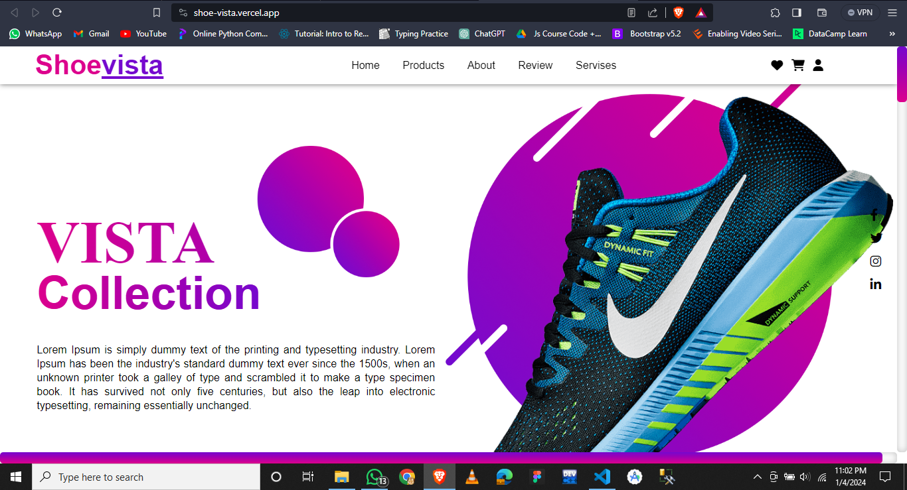

# ShoeVista

## Description
ShoeVista is a stylish and user-friendly shoe website designed to elevate your online shopping experience. Explore a vast collection of trendy footwear, from casual sneakers to elegant heels, all curated to keep you in step with the latest fashion trends. Our website offers a seamless interface, smooth navigation, and a visually appealing showcase of our diverse shoe inventory. Whether you're a sneakerhead or a fashion enthusiast, ShoeVista is your go-to destination for the perfect pair. Step into a world of footwear fashion with ShoeVista!

## Table of Contents
- [Installation](#installation)
- [Usage](#usage)
- [Demo](#demo)
- [Screenshots](#screenshots)
- [License](#license)
- [Contributing](#contributing)
- [Contact](#contact)

## Installation
Instructions on how to install and set up your project.

## Usage
Guidelines on how to use your project.

## Demo
Here is the demo link of the projetc (https://shoe-vista.vercel.app/)

## Screenshots


## License
Specify the license under which your project is distributed.

## Contributing
# Contributing to ShoeVista

We welcome contributions from the community to make ShoeVista even better! If you'd like to contribute, follow the guidelines below:

## Getting Started

1. **Fork the Repository:** Fork the ShoeVista repository by clicking on the 'Fork' button at the top right of the page.

2. **Clone the Repository:** Clone your forked repository to your local machine:

    ```bash
    git clone https://github.com/abdul-wahab619/ShoeVista.git
    ```

3. **Create a New Branch:** Create a new branch for your contributions:

    ```bash
    git checkout -b feature-your-feature
    ```

4. **Make Changes:** Make your changes and ensure they follow our coding standards.

## Making Changes

1. **Test Your Changes:** Test your changes thoroughly to ensure they don't introduce any issues.

2. **Commit Changes:** Keep your commits focused and provide meaningful commit messages.

3. **Update Documentation:** Update the documentation if your changes impact it.

## Submitting Changes

1. **Push Changes:** Push your changes to your forked repository:

    ```bash
    git push origin feature-your-feature
    ```

2. **Create Pull Request (PR):** Create a pull request to the `main` branch of the ShoeVista repository.

3. **Describe Your Changes:** Ensure your PR includes a clear description of the changes and why they are necessary.

## Issue Reporting

If you find a bug or have a suggestion, please [open an issue](link-to-issue-page) on the ShoeVista repository. Clearly describe the problem or enhancement you'd like to see.

Thank you for considering contributing to ShoeVista! Your support helps us create a better platform for all shoe enthusiasts.

## Contact
Here is my email you can contact me for more info (awminhas619@gmail.com).
